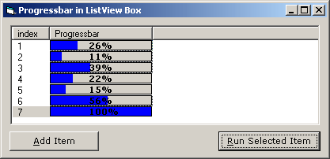



## Add a Progressbar to a listview box

### Description

Add a Progress bar to a listview box like napster, kaza, limewire, bearshare and most other p2p network clients... VERY EASY! (not a single API call)
 
### More Info
 

             |
---                |---
**Submitted On**   |2004-10-10 20:01:56
**By**             |[Brian Molidor](https://github.com/Planet-Source-Code/PSCIndex/blob/master/ByAuthor/brian-molidor.md)
**Level**          |Intermediate
**User Rating**    |4.6 (37 globes from 8 users)
**Compatibility**  |VB 5\.0, VB 6\.0
**Category**       |[Miscellaneous](https://github.com/Planet-Source-Code/PSCIndex/blob/master/ByCategory/miscellaneous__1-1.md)
**World**          |[Visual Basic](https://github.com/Planet-Source-Code/PSCIndex/blob/master/ByWorld/visual-basic.md)
**Archive File**   |[Add\_a\_Prog18037710102004\.zip](https://github.com/Planet-Source-Code/brian-molidor-add-a-progressbar-to-a-listview-box__1-56660/archive/master.zip)

